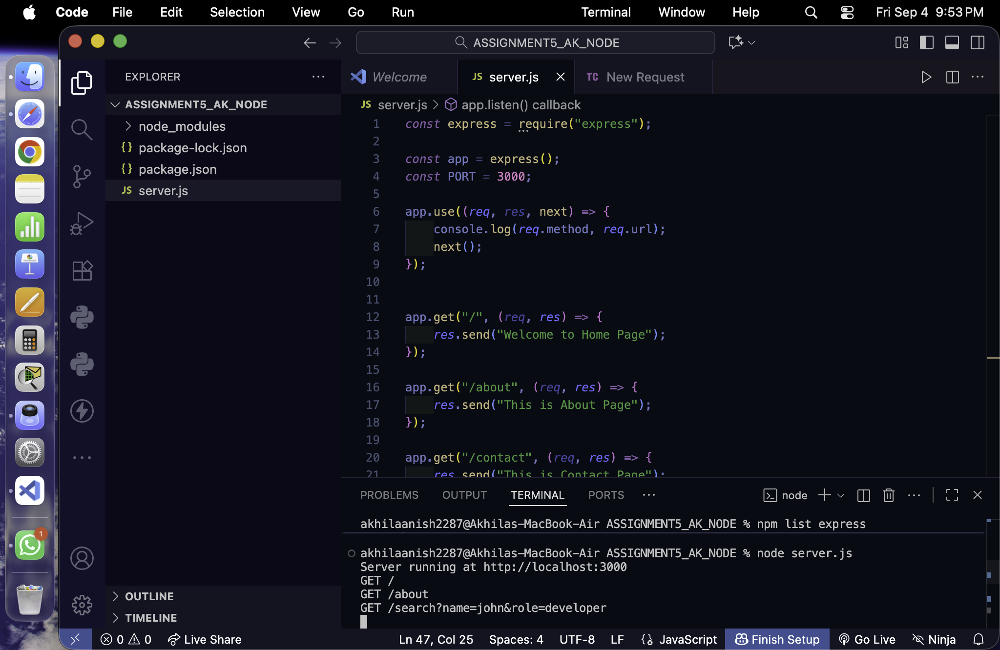
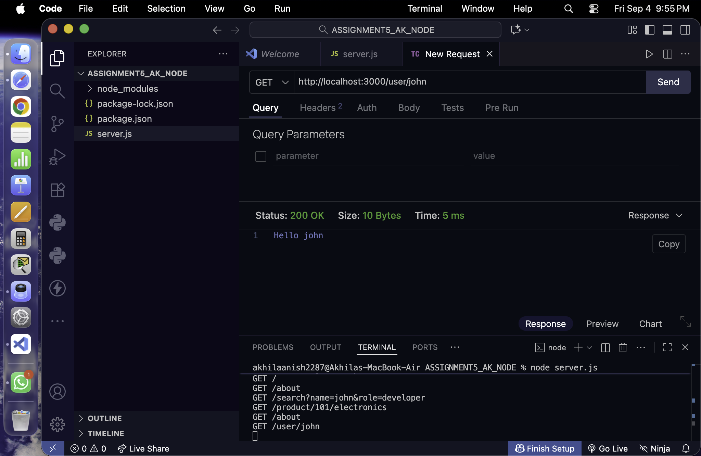
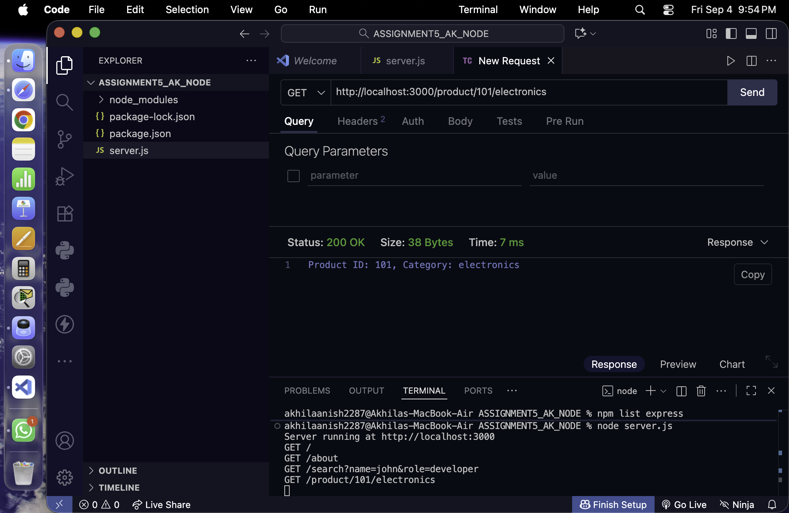
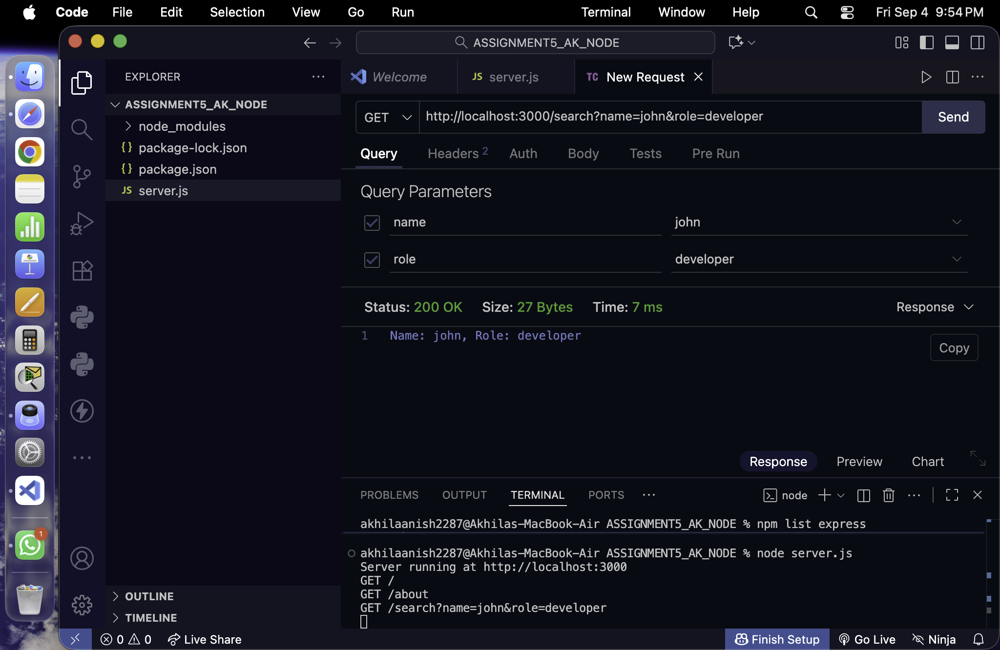
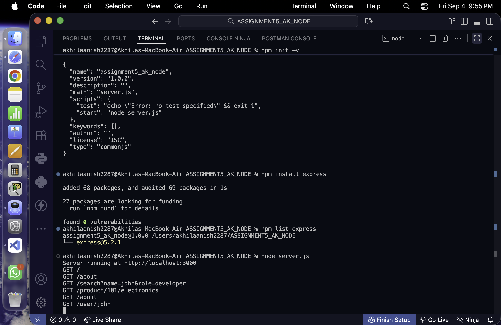

# Express Basics Assignment

This assignment demonstrates basic routing in Node.js using Express.js.

## Technologies Used

* Node.js
* Express.js

## Project Structure

```text
ASSIGNMENT5_AK_NODE/
│
├── server.js
├── package.json
├── package-lock.json
└── README.md
```

## Installation

Open the project folder in Terminal and run:

```bash
npm init -y
```

Then install Express:

```bash
npm install express
```

Express was installed successfully in this project.

```text
express@5.2.1
```

## Running the Server

Start the server using:

```bash
node server.js
```

The server starts at:

```text
Server running at http://localhost:3000
```

You can also start it using:

```bash
npm start
```

---

# Routes

## 1. Basic Routes

### Home Page

**GET /**

URL:

```text
http://localhost:3000/
```

Output:

```text
Welcome to Home Page
```

### About Page

**GET /about**

URL:

```text
http://localhost:3000/about
```

Output:

```text
This is About Page
```

### Contact Page

**GET /contact**

URL:

```text
http://localhost:3000/contact
```

Output:

```text
This is Contact Page
```

---

## 2. Route Parameter

### User Route

**GET /user/:name**

The name is taken dynamically from the URL using a route parameter.

Example:

```text
http://localhost:3000/user/john
```

Output:

```text
Hello john
```

Another example:

```text
http://localhost:3000/user/akhila
```

Output:

```text
Hello akhila
```

The value is accessed using:

```javascript
req.params.name
```

---

## 3. Multiple Route Parameters

### Product Route

**GET /product/:id/:category**

This route accepts two dynamic values: product ID and category.

Example:

```text
http://localhost:3000/product/101/electronics
```

Output:

```text
Product ID: 101, Category: electronics
```

The values are accessed using:

```javascript
req.params.id
req.params.category
```

---

## 4. Query Parameters

### Search Route

**GET /search**

This route reads values from query parameters.

Example:

```text
http://localhost:3000/search?name=john&role=developer
```

Output:

```text
Name: john, Role: developer
```

The values are accessed using:

```javascript
req.query.name
req.query.role
```

---

# Request Logging

The server also displays the request method and URL in the Terminal for each request.

Example:

```text
GET /
GET /about
GET /contact
GET /user/john
GET /product/101/electronics
GET /search?name=john&role=developer
```

---

# Screenshots

## Server Running

The server was successfully started using `node server.js`.

**Screenshot:**




---

## Basic Routes

The Home, About and Contact routes were tested in the browser.

**Screenshot:**


---

## Dynamic Route

The `/user/:name` route was tested with a dynamic name.

**Example:**

```text
http://localhost:3000/user/john
```

**Screenshot:**



---

## Multiple Route Parameters

The product route was tested using:

```text
http://localhost:3000/product/101/electronics
```

**Screenshot:**



---

## Query Parameters

The search route was tested using:

```text
http://localhost:3000/search?name=john&role=developer
```

**Screenshot:**




---

## Terminal Request Logs

The Terminal displays the HTTP method and URL for the requests.

**Screenshot:**



---

# Conclusion

The Express server was successfully created and tested. The assignment demonstrates basic routes, route parameters, multiple route parameters, query parameters, and request logging.

---

# Node.js Assignment 5 — Express Basics

**Name:** Akhila Anish Das <br>
**Roll No:** 150096725016 <br>
**Batch:** Larry Page <br>
**Year:** 2025-2029 <br>
**Assignment:** Node.js Assignment 5
